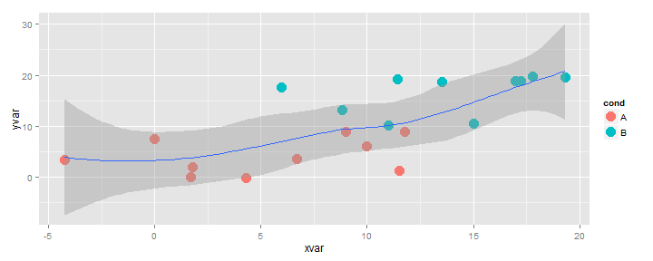

<script src = 'http://d3js.org/d3.v3.js' meta-charset='utf-8'></script>

# R Interactive Graphics with SVG

It seems computer history is [full of examples](http://worrydream.com/#!/TheFutureOfProgramming) of forgotten concepts from programmers ahead of their time.

### Before [d3 (2011)](https://github.com/mbostock/d3/releases?after=v1.20.2) and Even [Protovis (2009)](http://mbostock.github.io/protovis/)

Long before the 2011 release of [d3.js](http://d3js.org) and 2009 launch of [Protovis](http://mbostock.github.io/protovis/) and even before Hans Rosling's famous [example](http://www.gapminder.org/), the folks at [carto.net](http://www.carto.net/papers/) were doing amazing and revolutionary interactive graphics in SVG.  Consider this 2006 [Interactive Map of Yosemite](http://www.carto.net/williams/yosemite/) described in the [paper by Juliana Williams and Andreas Neumann](http://www.carto.net/neumann/papers/2006/bohinj_slovenia_2006_williams_neumann.pdf).

<iframe height = "400"  width = "900" src = "http://www.carto.net/williams/yosemite/"></iframe>

Building on this body of knowledge, some well known R contributors Deborah Nolan and Duncan Temple Lang (authors of the upcoming book <a href="http://www.amazon.com/gp/product/1461478995/ref=as_li_ss_tl?ie=UTF8&camp=1789&creative=390957&creativeASIN=1461478995&linkCode=as2&tag=timelyp-20">XML and Web Technologies for Data Sciences with R (Use R!)</a>
) created the R package `SVGAnnotation` described in **Journal of Statistical Software** *Vol 46 Issue 1* ([submitted paper](http://www.jstatsoft.org/v46/i01) and [html version](http://www.omegahat.org/SVGAnnotation/SVGAnnotationPaper/SVGAnnotationPaper.html#bib:SVGAnnotation)).  The article demonstrates how to achieve SVG interactivity straight from R still a year before [d3.js](http://d3js.org) first release.  Embedded below are two examples of [many](http://www.omegahat.org/SVGAnnotation/SVGAnnotationPaper/XMLExamples/quakes_tips.svg), each created directly from R.  You should see some animation and tooltips on hover.

<iframe height = "400"  width = "900" src = "http://www.omegahat.org/SVGAnnotation/SVGAnnotationPaper/XMLExamples/gapM.svg"></iframe>

<iframe height = "400"  width = "900" src = "http://www.omegahat.org/SVGAnnotation/SVGAnnotationPaper/XMLExamples/quakes_tips.svg"></iframe>

Now let's fast forward 3 years to 2013 where the concept of the HTML5/SVG/javascript combination for interactive graphics is [ultra popular](https://github.com/popular/starred) and [well established](http://biovisualize.github.io/d3visualization/) through [d3.js](http://d3js.org).  The novel element of d3 is its ability to bind data to elements of a document to create the 3 d's of d3--data-driven documents.

## Just a Little Bit of Glue
For R, we just need a little bit of glue to blend the old with the new to directly harness the power of SVG interactivity and d3 data binding.  It seems there are 3 types of glue available:

1.  Let R do the data and then send the data to Javascript to create the SVG graphics.  This is the process employed by [rCharts](http://rcharts.io/site), [clickme](http://rclickme.com/), [d3network](http://christophergandrud.github.io/d3Network/), [googleVis](http://cran.r-project.org/web/packages/googleVis/index.html), [gigvis](https://github.com/rstudio/gigvis), and [tabplotd3](http://cran.r-project.org/web/packages/tabplotd3/index.html).

2.  Let R both do the data and render the graph then export the SVG to get interactivity from Javascript.  We see this with the new and improved [gridSVG](http://sjp.co.nz/projects/gridsvg/) and the previously mentioned [SVGAnnotation](http://www.omegahat.org/SVGAnnotation/SVGAnnotationPaper/SVGAnnotationPaper.html#bib:SVGAnnotation).

3.  Use 1. or 2. and then maintain bidirectional communication between R and Javascript through [shiny](http://rstudio.com/shiny), [Rook](http://cran.r-project.org/web/packages/Rook/index.html), or some other web server type interface.

I believe the choice of method will depend on the user's competence in R and/or Javascript, their desire for customization, and the need for R's data calculation abilities post-render.  I have posted a lot about using method 1 with rCharts and clickme, so I wanted to start a series of demos using method 2.  Method 3 is fairly trivial with the full-featured Shiny and Rook once we have 1 and 2 conquered.

## Method 2 | R Draw and Render SVG with a d3 Reverse Data Bind
Much of the R to SVG is already shown [in this blog](http://stattech.wordpress.fos.auckland.ac.nz/) from the R Mecca in New Zealand.  As Simon Potter has extended SVGAnnotation while improving gridSVG, he has documented the process and the improvements on the same blog and in his soon-to-be-marked Masters' thesis.  Since there are still few examples of the data bind step that we know and love from d3 but in reverse, I thought I would share a quick experiment doing a reverse data bind using d3 on a R/gridSVG exported graph.  For those not familiar with d3, Mike Bostock's [Three Little Circles](http://mbostock.github.io/d3/tutorial/circle.html) will be very helpful.


If we choose gridSVG, we lose `base` graphics (SVGAnnotation does allow `base`), but I believe its advantages overcome this loss, and we still have the super-powerful `grid` graphics libraries `lattice` and `ggplot2`.  For this example, I will build on top of a ggplot2 scatter plot example from Winston Chang's [Cookbook from R](http://www.cookbook-r.com/Graphs/Scatterplots_(ggplot2)).  This is the supporting website for his book

<iframe src="http://rcm-na.amazon-adsystem.com/e/cm?lt1=_blank&bc1=000000&IS1=1&bg1=FFFFFF&fc1=000000&lc1=0000FF&t=timelyp-20&o=1&p=8&l=as4&m=amazon&f=ifr&ref=ss_til&asins=1449316956" style="width:120px;height:240px;" scrolling="no" marginwidth="0" marginheight="0" frameborder="0"></iframe>.

Here is the slightly modified code that will produce our starting chart.  I will keep the smoothing even though we will not use it to show how we can preserve some R features not implemented as well in javascript.  Now would be a good time to get the newest gridSVG with `install.packages("gridSVG", repos="http://R-Forge.R-project.org")`.


```r
#get the latest version of gridSVG
#install.packages("gridSVG", repos="http://R-Forge.R-project.org")

require(ggplot2)

set.seed(955)
# Make some noisily increasing data
dat <- data.frame(cond = rep(c("A", "B"), each=10),
                  xvar = 1:20 + rnorm(20,sd=3),
                  yvar = 1:20 + rnorm(20,sd=3))
# cond         xvar         yvar
#    A -4.252354091  3.473157275
#    A  1.702317971  0.005939612
#   ... 
#    B 17.793359218 19.718587761
#    B 19.319909163 19.647899863

g4 <- ggplot(dat, aes(x=xvar, y=yvar)) +
  geom_point(shape=19, aes(color = cond), size=5) +    # Use hollow circles
  geom_smooth()

g4
```

 


There are lots of ways that we might add a tooltip if that is all we want.  However, I think we will want more than just tooltips, so a full d3-style data bind will be a fine way to achieve this extra functionality.  When we export our graphic, we will get an impercetibly SVG copy of our ggplot2 graphic above.  If you don't believe it is SVG, left-click on the graphic and Inspect Element.  I told you it was SVG.  If you still don't believe me, zoom in to 400% and see if you can tell a difference between SVG and png.


```r
require(gridSVG)
#print our ggplot2 graphic again
g4
#export to SVG file and R object
#grid.export deprecates the older gridToSVG
g4.svg <- grid.export("plot1.svg",addClasses=TRUE)
#print our newly exported SVG inline
cat(saveXML(g4.svg$svg))
```

<svg xmlns="http://www.w3.org/2000/svg" xmlns:xlink="http://www.w3.org/1999/xlink" width="720px" height="288px" viewBox="0 0 720 288" version="1.1">
  <metadata xmlns:gridsvg="http://www.stat.auckland.ac.nz/~paul/R/gridSVG/">
    <gridsvg:generator name="gridSVG" version="1.3-0" time="2013-08-05 16:59:09"/>
    <gridsvg:argument name="name" value="plot1.svg"/>
    <gridsvg:argument name="exportCoords" value="none"/>
    <gridsvg:argument name="exportMappings" value="none"/>
    <gridsvg:argument name="exportJS" value="none"/>
    <gridsvg:argument name="res" value="72"/>
    <gridsvg:argument name="prefix" value=""/>
    <gridsvg:argument name="addClasses" value="TRUE"/>
    <gridsvg:argument name="indent" value="TRUE"/>
    <gridsvg:argument name="htmlWrapper" value="FALSE"/>
    <gridsvg:argument name="usePaths" value="vpPaths"/>
    <gridsvg:argument name="uniqueNames" value="TRUE"/>
    <gridsvg:separator name="id.sep" value="."/>
    <gridsvg:separator name="gPath.sep" value="::"/>
    <gridsvg:separator name="vpPath.sep" value="::"/>
  </metadata>
  <g transform="translate(0, 288) scale(1, -1)">
    <g id="gridSVG" fill="none" stroke="rgb(0,0,0)" stroke-dasharray="none" stroke-width="0.75" font-size="12" font-family="Helvetica, Arial, FreeSans, Liberation Sans, Nimbus Sans L, sans-serif" opacity="1" stroke-linecap="round" stroke-linejoin="round" stroke-miterlimit="10" stroke-opacity="1" fill-opacity="0" font-weight="normal" font-style="normal">
      <defs>
        <symbol id="gridSVG.pch19" viewBox="-5 -5 10 10" overflow="visible">
          <circle cx="0" cy="0" r="3.75"/>
        </symbol>
      </defs>
      <g id="layout.1" class="pushedvp viewport">
        <g id="GRID.gTableParent.120.1" class="gTableParent gTree grob gDesc">
          <defs>
            <clipPath id="layout::background.1-6-6-1.1.clipPath">
              <rect x="0" y="0" width="720" height="288" fill="none" stroke="none"/>
            </clipPath>
          </defs>
          <g id="layout::background.1-6-6-1.1" clip-path="url(#layout::background.1-6-6-1.1.clipPath)" class="pushedvp viewport">
            <g id="background.1-6-6-1.1" class="gTableChild rect grob gDesc">
              <rect id="background.1-6-6-1.1.1" x="0" y="0" width="720" height="288" stroke-width="1.06" stroke="rgb(255,255,255)" fill="rgb(255,255,255)" stroke-dasharray="none" stroke-opacity="1" fill-opacity="1"/>
            </g>
          </g>
          <g id="layout::spacer.4-3-4-3.1" class="pushedvp viewport"/>
          <defs>
            <clipPath id="layout::panel.3-4-3-4.1.clipPath">
              <rect x="41.22" y="37.28" width="609.69" height="236.32" fill="none" stroke="none"/>
            </clipPath>
          </defs>
          <g id="layout::panel.3-4-3-4.1" clip-path="url(#layout::panel.3-4-3-4.1.clipPath)" class="pushedvp viewport">
            <g id="panel.3-4-3-4.1" class="gTableChild gTree grob gDesc">
              <g id="grill.gTree.84.1" class="gTree grob gDesc">
                <g id="panel.background.rect.75.1" class="rect grob gDesc">
                  <rect id="panel.background.rect.75.1.1" x="41.22" y="37.28" width="609.69" height="236.32" stroke-width="1.06" stroke="none" fill="rgb(229,229,229)" stroke-dasharray="none" stroke-opacity="0" fill-opacity="1"/>
                </g>
                <g id="panel.grid.minor.y.polyline.77.1" class="polyline grob gDesc">
                  <polyline id="panel.grid.minor.y.polyline.77.1.1" points="41.22,62.03 650.92,62.03" stroke-width="0.53" stroke="rgb(242,242,242)" stroke-dasharray="none" stroke-linecap="butt" stroke-opacity="1" fill="none"/>
                  <polyline id="panel.grid.minor.y.polyline.77.1.2" points="41.22,118.9 650.92,118.9" stroke-width="0.53" stroke="rgb(242,242,242)" stroke-dasharray="none" stroke-linecap="butt" stroke-opacity="1" fill="none"/>
                  <polyline id="panel.grid.minor.y.polyline.77.1.3" points="41.22,175.76 650.92,175.76" stroke-width="0.53" stroke="rgb(242,242,242)" stroke-dasharray="none" stroke-linecap="butt" stroke-opacity="1" fill="none"/>
                  <polyline id="panel.grid.minor.y.polyline.77.1.4" points="41.22,232.63 650.92,232.63" stroke-width="0.53" stroke="rgb(242,242,242)" stroke-dasharray="none" stroke-linecap="butt" stroke-opacity="1" fill="none"/>
                </g>
                <g id="panel.grid.minor.x.polyline.79.1" class="polyline grob gDesc">
                  <polyline id="panel.grid.minor.x.polyline.79.1.1" points="110.14,37.28 110.14,273.6" stroke-width="0.53" stroke="rgb(242,242,242)" stroke-dasharray="none" stroke-linecap="butt" stroke-opacity="1" fill="none"/>
                  <polyline id="panel.grid.minor.x.polyline.79.1.2" points="227.71,37.28 227.71,273.6" stroke-width="0.53" stroke="rgb(242,242,242)" stroke-dasharray="none" stroke-linecap="butt" stroke-opacity="1" fill="none"/>
                  <polyline id="panel.grid.minor.x.polyline.79.1.3" points="345.28,37.28 345.28,273.6" stroke-width="0.53" stroke="rgb(242,242,242)" stroke-dasharray="none" stroke-linecap="butt" stroke-opacity="1" fill="none"/>
                  <polyline id="panel.grid.minor.x.polyline.79.1.4" points="462.84,37.28 462.84,273.6" stroke-width="0.53" stroke="rgb(242,242,242)" stroke-dasharray="none" stroke-linecap="butt" stroke-opacity="1" fill="none"/>
                  <polyline id="panel.grid.minor.x.polyline.79.1.5" points="580.41,37.28 580.41,273.6" stroke-width="0.53" stroke="rgb(242,242,242)" stroke-dasharray="none" stroke-linecap="butt" stroke-opacity="1" fill="none"/>
                </g>
                <g id="panel.grid.major.y.polyline.81.1" class="polyline grob gDesc">
                  <polyline id="panel.grid.major.y.polyline.81.1.1" points="41.22,90.46 650.92,90.46" stroke-width="1.06" stroke="rgb(255,255,255)" stroke-dasharray="none" stroke-linecap="butt" stroke-opacity="1" fill="none"/>
                  <polyline id="panel.grid.major.y.polyline.81.1.2" points="41.22,147.33 650.92,147.33" stroke-width="1.06" stroke="rgb(255,255,255)" stroke-dasharray="none" stroke-linecap="butt" stroke-opacity="1" fill="none"/>
                  <polyline id="panel.grid.major.y.polyline.81.1.3" points="41.22,204.2 650.92,204.2" stroke-width="1.06" stroke="rgb(255,255,255)" stroke-dasharray="none" stroke-linecap="butt" stroke-opacity="1" fill="none"/>
                  <polyline id="panel.grid.major.y.polyline.81.1.4" points="41.22,261.07 650.92,261.07" stroke-width="1.06" stroke="rgb(255,255,255)" stroke-dasharray="none" stroke-linecap="butt" stroke-opacity="1" fill="none"/>
                </g>
                <g id="panel.grid.major.x.polyline.83.1" class="polyline grob gDesc">
                  <polyline id="panel.grid.major.x.polyline.83.1.1" points="51.36,37.28 51.36,273.6" stroke-width="1.06" stroke="rgb(255,255,255)" stroke-dasharray="none" stroke-linecap="butt" stroke-opacity="1" fill="none"/>
                  <polyline id="panel.grid.major.x.polyline.83.1.2" points="168.92,37.28 168.92,273.6" stroke-width="1.06" stroke="rgb(255,255,255)" stroke-dasharray="none" stroke-linecap="butt" stroke-opacity="1" fill="none"/>
                  <polyline id="panel.grid.major.x.polyline.83.1.3" points="286.49,37.28 286.49,273.6" stroke-width="1.06" stroke="rgb(255,255,255)" stroke-dasharray="none" stroke-linecap="butt" stroke-opacity="1" fill="none"/>
                  <polyline id="panel.grid.major.x.polyline.83.1.4" points="404.06,37.28 404.06,273.6" stroke-width="1.06" stroke="rgb(255,255,255)" stroke-dasharray="none" stroke-linecap="butt" stroke-opacity="1" fill="none"/>
                  <polyline id="panel.grid.major.x.polyline.83.1.5" points="521.63,37.28 521.63,273.6" stroke-width="1.06" stroke="rgb(255,255,255)" stroke-dasharray="none" stroke-linecap="butt" stroke-opacity="1" fill="none"/>
                  <polyline id="panel.grid.major.x.polyline.83.1.6" points="639.19,37.28 639.19,273.6" stroke-width="1.06" stroke="rgb(255,255,255)" stroke-dasharray="none" stroke-linecap="butt" stroke-opacity="1" fill="none"/>
                </g>
              </g>
              <g id="geom_point.points.66.1" class="points grob gDesc">
                <use id="geom_point.points.66.1.1" xlink:href="#gridSVG.pch19" x="68.94" y="110.21" width="14.17" height="14.17" transform="translate(-7.09,-7.09)" stroke="rgb(248,118,109)" fill="rgb(248,118,109)" font-size="14.17" stroke-width="0.53" stroke-opacity="1" fill-opacity="1"/>
                <use id="geom_point.points.66.1.2" xlink:href="#gridSVG.pch19" x="208.95" y="90.5" width="14.17" height="14.17" transform="translate(-7.09,-7.09)" stroke="rgb(248,118,109)" fill="rgb(248,118,109)" font-size="14.17" stroke-width="0.53" stroke-opacity="1" fill-opacity="1"/>
                <use id="geom_point.points.66.1.3" xlink:href="#gridSVG.pch19" x="270.57" y="89.93" width="14.17" height="14.17" transform="translate(-7.09,-7.09)" stroke="rgb(248,118,109)" fill="rgb(248,118,109)" font-size="14.17" stroke-width="0.53" stroke-opacity="1" fill-opacity="1"/>
                <use id="geom_point.points.66.1.4" xlink:href="#gridSVG.pch19" x="210.79" y="102.25" width="14.17" height="14.17" transform="translate(-7.09,-7.09)" stroke="rgb(248,118,109)" fill="rgb(248,118,109)" font-size="14.17" stroke-width="0.53" stroke-opacity="1" fill-opacity="1"/>
                <use id="geom_point.points.66.1.5" xlink:href="#gridSVG.pch19" x="440.21" y="97.37" width="14.17" height="14.17" transform="translate(-7.09,-7.09)" stroke="rgb(248,118,109)" fill="rgb(248,118,109)" font-size="14.17" stroke-width="0.53" stroke-opacity="1" fill-opacity="1"/>
                <use id="geom_point.points.66.1.6" xlink:href="#gridSVG.pch19" x="325.81" y="110.98" width="14.17" height="14.17" transform="translate(-7.09,-7.09)" stroke="rgb(248,118,109)" fill="rgb(248,118,109)" font-size="14.17" stroke-width="0.53" stroke-opacity="1" fill-opacity="1"/>
                <use id="geom_point.points.66.1.7" xlink:href="#gridSVG.pch19" x="169.02" y="133.28" width="14.17" height="14.17" transform="translate(-7.09,-7.09)" stroke="rgb(248,118,109)" fill="rgb(248,118,109)" font-size="14.17" stroke-width="0.53" stroke-opacity="1" fill-opacity="1"/>
                <use id="geom_point.points.66.1.8" xlink:href="#gridSVG.pch19" x="403.39" y="125.47" width="14.17" height="14.17" transform="translate(-7.09,-7.09)" stroke="rgb(248,118,109)" fill="rgb(248,118,109)" font-size="14.17" stroke-width="0.53" stroke-opacity="1" fill-opacity="1"/>
                <use id="geom_point.points.66.1.9" xlink:href="#gridSVG.pch19" x="380.72" y="141.28" width="14.17" height="14.17" transform="translate(-7.09,-7.09)" stroke="rgb(248,118,109)" fill="rgb(248,118,109)" font-size="14.17" stroke-width="0.53" stroke-opacity="1" fill-opacity="1"/>
                <use id="geom_point.points.66.1.10" xlink:href="#gridSVG.pch19" x="445.61" y="141.23" width="14.17" height="14.17" transform="translate(-7.09,-7.09)" stroke="rgb(248,118,109)" fill="rgb(248,118,109)" font-size="14.17" stroke-width="0.53" stroke-opacity="1" fill-opacity="1"/>
                <use id="geom_point.points.66.1.11" xlink:href="#gridSVG.pch19" x="376.79" y="165.54" width="14.17" height="14.17" transform="translate(-7.09,-7.09)" stroke="rgb(0,191,196)" fill="rgb(0,191,196)" font-size="14.17" stroke-width="0.53" stroke-opacity="1" fill-opacity="1"/>
                <use id="geom_point.points.66.1.12" xlink:href="#gridSVG.pch19" x="309.4" y="190.81" width="14.17" height="14.17" transform="translate(-7.09,-7.09)" stroke="rgb(0,191,196)" fill="rgb(0,191,196)" font-size="14.17" stroke-width="0.53" stroke-opacity="1" fill-opacity="1"/>
                <use id="geom_point.points.66.1.13" xlink:href="#gridSVG.pch19" x="522.45" y="150.09" width="14.17" height="14.17" transform="translate(-7.09,-7.09)" stroke="rgb(0,191,196)" fill="rgb(0,191,196)" font-size="14.17" stroke-width="0.53" stroke-opacity="1" fill-opacity="1"/>
                <use id="geom_point.points.66.1.14" xlink:href="#gridSVG.pch19" x="427.22" y="148.12" width="14.17" height="14.17" transform="translate(-7.09,-7.09)" stroke="rgb(0,191,196)" fill="rgb(0,191,196)" font-size="14.17" stroke-width="0.53" stroke-opacity="1" fill-opacity="1"/>
                <use id="geom_point.points.66.1.15" xlink:href="#gridSVG.pch19" x="487.37" y="196.7" width="14.17" height="14.17" transform="translate(-7.09,-7.09)" stroke="rgb(0,191,196)" fill="rgb(0,191,196)" font-size="14.17" stroke-width="0.53" stroke-opacity="1" fill-opacity="1"/>
                <use id="geom_point.points.66.1.16" xlink:href="#gridSVG.pch19" x="437.82" y="199.33" width="14.17" height="14.17" transform="translate(-7.09,-7.09)" stroke="rgb(0,191,196)" fill="rgb(0,191,196)" font-size="14.17" stroke-width="0.53" stroke-opacity="1" fill-opacity="1"/>
                <use id="geom_point.points.66.1.17" xlink:href="#gridSVG.pch19" x="568.11" y="197.56" width="14.17" height="14.17" transform="translate(-7.09,-7.09)" stroke="rgb(0,191,196)" fill="rgb(0,191,196)" font-size="14.17" stroke-width="0.53" stroke-opacity="1" fill-opacity="1"/>
                <use id="geom_point.points.66.1.18" xlink:href="#gridSVG.pch19" x="573.83" y="198.17" width="14.17" height="14.17" transform="translate(-7.09,-7.09)" stroke="rgb(0,191,196)" fill="rgb(0,191,196)" font-size="14.17" stroke-width="0.53" stroke-opacity="1" fill-opacity="1"/>
                <use id="geom_point.points.66.1.19" xlink:href="#gridSVG.pch19" x="587.31" y="202.6" width="14.17" height="14.17" transform="translate(-7.09,-7.09)" stroke="rgb(0,191,196)" fill="rgb(0,191,196)" font-size="14.17" stroke-width="0.53" stroke-opacity="1" fill-opacity="1"/>
                <use id="geom_point.points.66.1.20" xlink:href="#gridSVG.pch19" x="623.2" y="202.2" width="14.17" height="14.17" transform="translate(-7.09,-7.09)" stroke="rgb(0,191,196)" fill="rgb(0,191,196)" font-size="14.17" stroke-width="0.53" stroke-opacity="1" fill-opacity="1"/>
              </g>
              <g id="smooths.gTree.71.1" class="gTree grob gDesc">
                <g id="geom_ribbon.polygon.68.1" class="polygon grob gDesc">
                  <polygon id="geom_ribbon.polygon.68.1.1" points="68.94,177.15 75.95,172.15 82.97,167.52 89.98,163.26 97,159.37 104.02,155.86 111.03,152.73 118.05,149.98 125.06,147.61 132.08,145.62 139.1,143.99 146.11,142.72 153.13,141.78 160.14,141.15 167.16,140.79 174.18,140.69 181.19,140.8 188.21,141.09 195.22,141.53 202.24,142.09 209.26,142.75 216.27,143.47 223.29,144.26 230.3,145.21 237.32,146.38 244.34,147.82 251.35,149.52 258.37,151.41 265.39,153.38 272.4,155.26 279.42,156.88 286.43,158.22 293.45,159.33 300.47,160.26 307.48,161.09 314.5,161.88 321.51,162.7 328.53,163.6 335.55,164.62 342.56,165.76 349.58,166.99 356.59,168.24 363.61,169.45 370.63,170.52 377.64,171.35 384.66,171.47 391.67,171.32 398.69,171.55 405.71,172.21 412.72,172.59 419.74,172.95 426.75,173.71 433.77,174.97 440.79,176.54 447.8,178.25 454.82,180.3 461.83,182.92 468.85,186.07 475.87,189.47 482.88,192.65 489.9,195.18 496.91,197.44 503.93,199.63 510.95,201.76 517.96,203.84 524.98,205.89 531.99,207.93 539.01,209.98 546.03,212.05 553.04,214.19 560.06,216.45 567.08,218.93 574.09,221.75 581.11,225.15 588.12,229.32 595.14,234.35 602.16,240.26 609.17,247.02 616.19,254.57 623.2,262.86 623.2,154.69 616.19,158.39 609.17,161.38 602.16,163.57 595.14,164.91 588.12,165.37 581.11,164.96 574.09,163.75 567.08,161.85 560.06,159.44 553.04,156.68 546.03,153.71 539.01,150.62 531.99,147.49 524.98,144.39 517.96,141.38 510.95,138.52 503.93,135.86 496.91,133.45 489.9,131.37 482.88,129.76 475.87,128.81 468.85,128.13 461.83,127.36 454.82,126.29 447.8,125 440.79,123.77 433.77,123 426.75,122.5 419.74,121.84 412.72,120.86 405.71,119.68 398.69,118.8 391.67,118.45 384.66,117.89 377.64,116.79 370.63,115.4 363.61,114.06 356.59,112.69 349.58,111.22 342.56,109.6 335.55,107.79 328.53,105.8 321.51,103.64 314.5,101.37 307.48,99.07 300.47,96.82 293.45,94.72 286.43,92.87 279.42,91.34 272.4,90.2 265.39,89.4 258.37,88.64 251.35,87.8 244.34,86.83 237.32,85.72 230.3,84.52 223.29,83.33 216.27,82.28 209.26,81.49 202.24,80.91 195.22,80.36 188.21,79.8 181.19,79.21 174.18,78.57 167.16,77.85 160.14,77.01 153.13,76.02 146.11,74.86 139.1,73.51 132.08,71.96 125.06,70.18 118.05,68.17 111.03,65.94 104.02,63.49 97,60.81 89.98,57.92 82.97,54.82 75.95,51.52 68.94,48.02" fill="rgb(153,153,153)" stroke="none" stroke-width="1.06" stroke-dasharray="none" stroke-opacity="0" fill-opacity="0.4"/>
                </g>
                <g id="GRID.polyline.69.1" class="polyline grob gDesc">
                  <polyline id="GRID.polyline.69.1.1" points="68.94,112.59 75.95,111.84 82.97,111.17 89.98,110.59 97,110.09 104.02,109.68 111.03,109.34 118.05,109.08 125.06,108.9 132.08,108.79 139.1,108.75 146.11,108.79 153.13,108.9 160.14,109.08 167.16,109.32 174.18,109.63 181.19,110.01 188.21,110.44 195.22,110.94 202.24,111.5 209.26,112.12 216.27,112.87 223.29,113.8 230.3,114.87 237.32,116.05 244.34,117.33 251.35,118.66 258.37,120.02 265.39,121.39 272.4,122.73 279.42,124.11 286.43,125.55 293.45,127.03 300.47,128.54 307.48,130.08 314.5,131.62 321.51,133.17 328.53,134.7 335.55,136.21 342.56,137.68 349.58,139.1 356.59,140.46 363.61,141.75 370.63,142.96 377.64,144.07 384.66,144.68 391.67,144.89 398.69,145.17 405.71,145.94 412.72,146.72 419.74,147.4 426.75,148.11 433.77,148.98 440.79,150.15 447.8,151.62 454.82,153.3 461.83,155.14 468.85,157.1 475.87,159.14 482.88,161.21 489.9,163.28 496.91,165.45 503.93,167.74 510.95,170.14 517.96,172.61 524.98,175.14 531.99,177.71 539.01,180.3 546.03,182.88 553.04,185.44 560.06,187.95 567.08,190.39 574.09,192.75 581.11,195.05 588.12,197.35 595.14,199.63 602.16,201.91 609.17,204.2 616.19,206.48 623.2,208.77" stroke="rgb(51,102,255)" fill="none" stroke-width="1.06" stroke-dasharray="none" stroke-linecap="butt" stroke-linejoin="round" stroke-miterlimit="1" stroke-opacity="1" fill-opacity="1"/>
                </g>
              </g>
            </g>
          </g>
          <g id="layout::axis-l.3-3-3-3.1" class="pushedvp viewport">
            <g id="layout::axis-l.3-3-3-3::GRID.VP.6.1" class="pushedvp viewport">
              <g id="axis-l.3-3-3-3.1" class="gTableChild absoluteGrob gTree grob gDesc">
                <g id="layout::axis-l.3-3-3-3::GRID.VP.6::axis.1" class="pushedvp viewport">
                  <g id="GRID.gTableParent.125.1" class="gTableParent gTree grob gDesc">
                    <g id="layout::axis-l.3-3-3-3::GRID.VP.6::axis::axis.1-1-1-1.1" class="pushedvp viewport">
                      <g id="axis.1-1-1-1.1" class="gTableChild text grob gDesc">
                        <g id="axis.1-1-1-1.1.1" transform="translate(34.14, 90.46)" stroke-width="0.1">
                          <g id="axis.1-1-1-1.1.1.scale" transform="scale(1, -1)">
                            <text x="0" y="0" id="axis.1-1-1-1.1.1.text" text-anchor="end" font-size="9.6" stroke="rgb(127,127,127)" font-family="Helvetica, Arial, FreeSans, Liberation Sans, Nimbus Sans L, sans-serif" fill="rgb(127,127,127)" stroke-opacity="1" fill-opacity="1" font-weight="normal" font-style="normal">
                              <tspan id="axis.1-1-1-1.1.1.tspan.1" dy="3.59" x="0">0</tspan>
                            </text>
                          </g>
                        </g>
                        <g id="axis.1-1-1-1.1.2" transform="translate(34.14, 147.33)" stroke-width="0.1">
                          <g id="axis.1-1-1-1.1.2.scale" transform="scale(1, -1)">
                            <text x="0" y="0" id="axis.1-1-1-1.1.2.text" text-anchor="end" font-size="9.6" stroke="rgb(127,127,127)" font-family="Helvetica, Arial, FreeSans, Liberation Sans, Nimbus Sans L, sans-serif" fill="rgb(127,127,127)" stroke-opacity="1" fill-opacity="1" font-weight="normal" font-style="normal">
                              <tspan id="axis.1-1-1-1.1.2.tspan.1" dy="3.59" x="0">10</tspan>
                            </text>
                          </g>
                        </g>
                        <g id="axis.1-1-1-1.1.3" transform="translate(34.14, 204.2)" stroke-width="0.1">
                          <g id="axis.1-1-1-1.1.3.scale" transform="scale(1, -1)">
                            <text x="0" y="0" id="axis.1-1-1-1.1.3.text" text-anchor="end" font-size="9.6" stroke="rgb(127,127,127)" font-family="Helvetica, Arial, FreeSans, Liberation Sans, Nimbus Sans L, sans-serif" fill="rgb(127,127,127)" stroke-opacity="1" fill-opacity="1" font-weight="normal" font-style="normal">
                              <tspan id="axis.1-1-1-1.1.3.tspan.1" dy="3.59" x="0">20</tspan>
                            </text>
                          </g>
                        </g>
                        <g id="axis.1-1-1-1.1.4" transform="translate(34.14, 261.07)" stroke-width="0.1">
                          <g id="axis.1-1-1-1.1.4.scale" transform="scale(1, -1)">
                            <text x="0" y="0" id="axis.1-1-1-1.1.4.text" text-anchor="end" font-size="9.6" stroke="rgb(127,127,127)" font-family="Helvetica, Arial, FreeSans, Liberation Sans, Nimbus Sans L, sans-serif" fill="rgb(127,127,127)" stroke-opacity="1" fill-opacity="1" font-weight="normal" font-style="normal">
                              <tspan id="axis.1-1-1-1.1.4.tspan.1" dy="3.59" x="0">30</tspan>
                            </text>
                          </g>
                        </g>
                      </g>
                    </g>
                    <g id="layout::axis-l.3-3-3-3::GRID.VP.6::axis::axis.1-2-1-2.1" class="pushedvp viewport">
                      <g id="axis.1-2-1-2.1" class="gTableChild polyline grob gDesc">
                        <polyline id="axis.1-2-1-2.1.1" points="36.97,90.46 41.22,90.46" stroke-width="1.06" stroke="rgb(127,127,127)" stroke-dasharray="none" stroke-linecap="butt" stroke-opacity="1" fill="none"/>
                        <polyline id="axis.1-2-1-2.1.2" points="36.97,147.33 41.22,147.33" stroke-width="1.06" stroke="rgb(127,127,127)" stroke-dasharray="none" stroke-linecap="butt" stroke-opacity="1" fill="none"/>
                        <polyline id="axis.1-2-1-2.1.3" points="36.97,204.2 41.22,204.2" stroke-width="1.06" stroke="rgb(127,127,127)" stroke-dasharray="none" stroke-linecap="butt" stroke-opacity="1" fill="none"/>
                        <polyline id="axis.1-2-1-2.1.4" points="36.97,261.07 41.22,261.07" stroke-width="1.06" stroke="rgb(127,127,127)" stroke-dasharray="none" stroke-linecap="butt" stroke-opacity="1" fill="none"/>
                      </g>
                    </g>
                  </g>
                </g>
              </g>
            </g>
          </g>
          <g id="layout::axis-b.4-4-4-4.1" class="pushedvp viewport">
            <g id="layout::axis-b.4-4-4-4::GRID.VP.5.1" class="pushedvp viewport">
              <g id="axis-b.4-4-4-4.1" class="gTableChild absoluteGrob gTree grob gDesc">
                <g id="layout::axis-b.4-4-4-4::GRID.VP.5::axis.1" class="pushedvp viewport">
                  <g id="GRID.gTableParent.131.1" class="gTableParent gTree grob gDesc">
                    <g id="layout::axis-b.4-4-4-4::GRID.VP.5::axis::axis.1-1-1-1.1" class="pushedvp viewport">
                      <g id="axis.1-1-1-1.2" class="gTableChild polyline grob gDesc">
                        <polyline id="axis.1-1-1-1.2.1" points="51.36,33.03 51.36,37.28" stroke-width="1.06" stroke="rgb(127,127,127)" stroke-dasharray="none" stroke-linecap="butt" stroke-opacity="1" fill="none"/>
                        <polyline id="axis.1-1-1-1.2.2" points="168.92,33.03 168.92,37.28" stroke-width="1.06" stroke="rgb(127,127,127)" stroke-dasharray="none" stroke-linecap="butt" stroke-opacity="1" fill="none"/>
                        <polyline id="axis.1-1-1-1.2.3" points="286.49,33.03 286.49,37.28" stroke-width="1.06" stroke="rgb(127,127,127)" stroke-dasharray="none" stroke-linecap="butt" stroke-opacity="1" fill="none"/>
                        <polyline id="axis.1-1-1-1.2.4" points="404.06,33.03 404.06,37.28" stroke-width="1.06" stroke="rgb(127,127,127)" stroke-dasharray="none" stroke-linecap="butt" stroke-opacity="1" fill="none"/>
                        <polyline id="axis.1-1-1-1.2.5" points="521.63,33.03 521.63,37.28" stroke-width="1.06" stroke="rgb(127,127,127)" stroke-dasharray="none" stroke-linecap="butt" stroke-opacity="1" fill="none"/>
                        <polyline id="axis.1-1-1-1.2.6" points="639.19,33.03 639.19,37.28" stroke-width="1.06" stroke="rgb(127,127,127)" stroke-dasharray="none" stroke-linecap="butt" stroke-opacity="1" fill="none"/>
                      </g>
                    </g>
                    <g id="layout::axis-b.4-4-4-4::GRID.VP.5::axis::axis.2-1-2-1.1" class="pushedvp viewport">
                      <g id="axis.2-1-2-1.1" class="gTableChild text grob gDesc">
                        <g id="axis.2-1-2-1.1.1" transform="translate(51.36, 30.2)" stroke-width="0.1">
                          <g id="axis.2-1-2-1.1.1.scale" transform="scale(1, -1)">
                            <text x="0" y="0" id="axis.2-1-2-1.1.1.text" text-anchor="middle" font-size="9.6" stroke="rgb(127,127,127)" font-family="Helvetica, Arial, FreeSans, Liberation Sans, Nimbus Sans L, sans-serif" fill="rgb(127,127,127)" stroke-opacity="1" fill-opacity="1" font-weight="normal" font-style="normal">
                              <tspan id="axis.2-1-2-1.1.1.tspan.1" dy="7.18" x="0">-5</tspan>
                            </text>
                          </g>
                        </g>
                        <g id="axis.2-1-2-1.1.2" transform="translate(168.92, 30.2)" stroke-width="0.1">
                          <g id="axis.2-1-2-1.1.2.scale" transform="scale(1, -1)">
                            <text x="0" y="0" id="axis.2-1-2-1.1.2.text" text-anchor="middle" font-size="9.6" stroke="rgb(127,127,127)" font-family="Helvetica, Arial, FreeSans, Liberation Sans, Nimbus Sans L, sans-serif" fill="rgb(127,127,127)" stroke-opacity="1" fill-opacity="1" font-weight="normal" font-style="normal">
                              <tspan id="axis.2-1-2-1.1.2.tspan.1" dy="7.18" x="0">0</tspan>
                            </text>
                          </g>
                        </g>
                        <g id="axis.2-1-2-1.1.3" transform="translate(286.49, 30.2)" stroke-width="0.1">
                          <g id="axis.2-1-2-1.1.3.scale" transform="scale(1, -1)">
                            <text x="0" y="0" id="axis.2-1-2-1.1.3.text" text-anchor="middle" font-size="9.6" stroke="rgb(127,127,127)" font-family="Helvetica, Arial, FreeSans, Liberation Sans, Nimbus Sans L, sans-serif" fill="rgb(127,127,127)" stroke-opacity="1" fill-opacity="1" font-weight="normal" font-style="normal">
                              <tspan id="axis.2-1-2-1.1.3.tspan.1" dy="7.18" x="0">5</tspan>
                            </text>
                          </g>
                        </g>
                        <g id="axis.2-1-2-1.1.4" transform="translate(404.06, 30.2)" stroke-width="0.1">
                          <g id="axis.2-1-2-1.1.4.scale" transform="scale(1, -1)">
                            <text x="0" y="0" id="axis.2-1-2-1.1.4.text" text-anchor="middle" font-size="9.6" stroke="rgb(127,127,127)" font-family="Helvetica, Arial, FreeSans, Liberation Sans, Nimbus Sans L, sans-serif" fill="rgb(127,127,127)" stroke-opacity="1" fill-opacity="1" font-weight="normal" font-style="normal">
                              <tspan id="axis.2-1-2-1.1.4.tspan.1" dy="7.18" x="0">10</tspan>
                            </text>
                          </g>
                        </g>
                        <g id="axis.2-1-2-1.1.5" transform="translate(521.63, 30.2)" stroke-width="0.1">
                          <g id="axis.2-1-2-1.1.5.scale" transform="scale(1, -1)">
                            <text x="0" y="0" id="axis.2-1-2-1.1.5.text" text-anchor="middle" font-size="9.6" stroke="rgb(127,127,127)" font-family="Helvetica, Arial, FreeSans, Liberation Sans, Nimbus Sans L, sans-serif" fill="rgb(127,127,127)" stroke-opacity="1" fill-opacity="1" font-weight="normal" font-style="normal">
                              <tspan id="axis.2-1-2-1.1.5.tspan.1" dy="7.18" x="0">15</tspan>
                            </text>
                          </g>
                        </g>
                        <g id="axis.2-1-2-1.1.6" transform="translate(639.19, 30.2)" stroke-width="0.1">
                          <g id="axis.2-1-2-1.1.6.scale" transform="scale(1, -1)">
                            <text x="0" y="0" id="axis.2-1-2-1.1.6.text" text-anchor="middle" font-size="9.6" stroke="rgb(127,127,127)" font-family="Helvetica, Arial, FreeSans, Liberation Sans, Nimbus Sans L, sans-serif" fill="rgb(127,127,127)" stroke-opacity="1" fill-opacity="1" font-weight="normal" font-style="normal">
                              <tspan id="axis.2-1-2-1.1.6.tspan.1" dy="7.18" x="0">20</tspan>
                            </text>
                          </g>
                        </g>
                      </g>
                    </g>
                  </g>
                </g>
              </g>
            </g>
          </g>
          <g id="layout::xlab.5-4-5-4.1" class="pushedvp viewport">
            <g id="xlab.5-4-5-4.1" class="gTableChild text grob gDesc">
              <g id="xlab.5-4-5-4.1.1" transform="translate(346.07, 15.11)" stroke-width="0.1">
                <g id="xlab.5-4-5-4.1.1.scale" transform="scale(1, -1)">
                  <text x="0" y="0" id="xlab.5-4-5-4.1.1.text" text-anchor="middle" font-size="12" stroke="rgb(0,0,0)" font-family="Helvetica, Arial, FreeSans, Liberation Sans, Nimbus Sans L, sans-serif" fill="rgb(0,0,0)" stroke-opacity="1" fill-opacity="1" font-weight="normal" font-style="normal">
                    <tspan id="xlab.5-4-5-4.1.1.tspan.1" dy="4.31" x="0">xvar</tspan>
                  </text>
                </g>
              </g>
            </g>
          </g>
          <g id="layout::ylab.3-2-3-2.1" class="pushedvp viewport">
            <g id="ylab.3-2-3-2.1" class="gTableChild text grob gDesc">
              <g id="ylab.3-2-3-2.1.1" transform="translate(15.11, 155.44)" stroke-width="0.1">
                <g id="ylab.3-2-3-2.1.1.scale" transform="scale(1, -1)">
                  <text x="0" y="0" id="ylab.3-2-3-2.1.1.text" transform="rotate(-90)" text-anchor="middle" font-size="12" stroke="rgb(0,0,0)" font-family="Helvetica, Arial, FreeSans, Liberation Sans, Nimbus Sans L, sans-serif" fill="rgb(0,0,0)" stroke-opacity="1" fill-opacity="1" font-weight="normal" font-style="normal">
                    <tspan id="ylab.3-2-3-2.1.1.tspan.1" dy="4.31" x="0">yvar</tspan>
                  </text>
                </g>
              </g>
            </g>
          </g>
          <g id="layout::guide-box.3-5-3-5.1" class="pushedvp viewport">
            <g id="layout::guide-box.3-5-3-5::guide-box.3-5-3-5.1" class="pushedvp viewport">
              <g id="layout::guide-box.3-5-3-5::guide-box.3-5-3-5::guide-box.3-5-3-5.1" class="pushedvp viewport">
                <g id="GRID.gTableChild.143.1" class="gTableChild gTableParent gTree grob gDesc">
                  <g id="layout::guide-box.3-5-3-5::guide-box.3-5-3-5::guide-box.3-5-3-5::guides.2-2-2-2.1" class="pushedvp viewport">
                    <g id="layout::guide-box.3-5-3-5::guide-box.3-5-3-5::guide-box.3-5-3-5::guides.2-2-2-2::guides.2-2-2-2.1" class="pushedvp viewport">
                      <g id="layout::guide-box.3-5-3-5::guide-box.3-5-3-5::guide-box.3-5-3-5::guides.2-2-2-2::guides.2-2-2-2::guides.2-2-2-2.1" class="pushedvp viewport">
                        <g id="GRID.gTableChild.144.1" class="gTableChild gTableParent gTree grob gDesc">
                          <g id="layout::guide-box.3-5-3-5::guide-box.3-5-3-5::guide-box.3-5-3-5::guides.2-2-2-2::guides.2-2-2-2::guides.2-2-2-2::background.1-6-6-1.1" class="pushedvp viewport">
                            <g id="background.1-6-6-1.2" class="gTableChild rect grob gDesc">
                              <rect id="background.1-6-6-1.2.1" x="660.95" y="128.16" width="34.61" height="54.56" stroke-width="1.06" stroke="none" fill="rgb(255,255,255)" stroke-dasharray="none" stroke-opacity="0" fill-opacity="1"/>
                            </g>
                          </g>
                          <g id="layout::guide-box.3-5-3-5::guide-box.3-5-3-5::guide-box.3-5-3-5::guides.2-2-2-2::guides.2-2-2-2::guides.2-2-2-2::title.2-5-2-2.1" class="pushedvp viewport">
                            <g id="title.2-5-2-2.1" class="gTableChild text grob gDesc">
                              <g id="title.2-5-2-2.1.1" transform="translate(665.2, 174.88)" stroke-width="0.1">
                                <g id="title.2-5-2-2.1.1.scale" transform="scale(1, -1)">
                                  <text x="0" y="0" id="title.2-5-2-2.1.1.text" text-anchor="start" font-size="9.6" stroke="rgb(0,0,0)" font-family="Helvetica, Arial, FreeSans, Liberation Sans, Nimbus Sans L, sans-serif" fill="rgb(0,0,0)" stroke-opacity="1" fill-opacity="1" font-weight="bold" font-style="normal">
                                    <tspan id="title.2-5-2-2.1.1.tspan.1" dy="3.59" x="0">cond</tspan>
                                  </text>
                                </g>
                              </g>
                            </g>
                          </g>
                          <g id="layout::guide-box.3-5-3-5::guide-box.3-5-3-5::guide-box.3-5-3-5::guides.2-2-2-2::guides.2-2-2-2::guides.2-2-2-2::key-3-1-bg.4-2-4-2.1" class="pushedvp viewport">
                            <g id="key-3-1-bg.4-2-4-2.1" class="gTableChild rect grob gDesc">
                              <rect id="key-3-1-bg.4-2-4-2.1.1" x="665.2" y="149.69" width="17.28" height="17.28" stroke-width="1.06" stroke="rgb(255,255,255)" fill="rgb(242,242,242)" stroke-dasharray="none" stroke-opacity="1" fill-opacity="1"/>
                            </g>
                          </g>
                          <g id="layout::guide-box.3-5-3-5::guide-box.3-5-3-5::guide-box.3-5-3-5::guides.2-2-2-2::guides.2-2-2-2::guides.2-2-2-2::key-3-1-1.4-2-4-2.1" class="pushedvp viewport">
                            <g id="key-3-1-1.4-2-4-2.1" class="gTableChild points grob gDesc">
                              <use id="key-3-1-1.4-2-4-2.1.1" xlink:href="#gridSVG.pch19" x="673.84" y="158.33" width="14.17" height="14.17" transform="translate(-7.09,-7.09)" stroke="rgb(248,118,109)" fill="rgb(248,118,109)" font-size="14.17" stroke-width="0.53" stroke-opacity="1" fill-opacity="1"/>
                            </g>
                          </g>
                          <g id="layout::guide-box.3-5-3-5::guide-box.3-5-3-5::guide-box.3-5-3-5::guides.2-2-2-2::guides.2-2-2-2::guides.2-2-2-2::key-4-1-bg.5-2-5-2.1" class="pushedvp viewport">
                            <g id="key-4-1-bg.5-2-5-2.1" class="gTableChild rect grob gDesc">
                              <rect id="key-4-1-bg.5-2-5-2.1.1" x="665.2" y="132.41" width="17.28" height="17.28" stroke-width="1.06" stroke="rgb(255,255,255)" fill="rgb(242,242,242)" stroke-dasharray="none" stroke-opacity="1" fill-opacity="1"/>
                            </g>
                          </g>
                          <g id="layout::guide-box.3-5-3-5::guide-box.3-5-3-5::guide-box.3-5-3-5::guides.2-2-2-2::guides.2-2-2-2::guides.2-2-2-2::key-4-1-1.5-2-5-2.1" class="pushedvp viewport">
                            <g id="key-4-1-1.5-2-5-2.1" class="gTableChild points grob gDesc">
                              <use id="key-4-1-1.5-2-5-2.1.1" xlink:href="#gridSVG.pch19" x="673.84" y="141.05" width="14.17" height="14.17" transform="translate(-7.09,-7.09)" stroke="rgb(0,191,196)" fill="rgb(0,191,196)" font-size="14.17" stroke-width="0.53" stroke-opacity="1" fill-opacity="1"/>
                            </g>
                          </g>
                          <g id="layout::guide-box.3-5-3-5::guide-box.3-5-3-5::guide-box.3-5-3-5::guides.2-2-2-2::guides.2-2-2-2::guides.2-2-2-2::label-3-3.4-4-4-4.1" class="pushedvp viewport">
                            <g id="label-3-3.4-4-4-4.1" class="gTableChild text grob gDesc">
                              <g id="label-3-3.4-4-4-4.1.1" transform="translate(684.64, 158.33)" stroke-width="0.1">
                                <g id="label-3-3.4-4-4-4.1.1.scale" transform="scale(1, -1)">
                                  <text x="0" y="0" id="label-3-3.4-4-4-4.1.1.text" text-anchor="start" font-size="9.6" stroke="rgb(0,0,0)" font-family="Helvetica, Arial, FreeSans, Liberation Sans, Nimbus Sans L, sans-serif" fill="rgb(0,0,0)" stroke-opacity="1" fill-opacity="1" font-weight="normal" font-style="normal">
                                    <tspan id="label-3-3.4-4-4-4.1.1.tspan.1" dy="3.59" x="0">A</tspan>
                                  </text>
                                </g>
                              </g>
                            </g>
                          </g>
                          <g id="layout::guide-box.3-5-3-5::guide-box.3-5-3-5::guide-box.3-5-3-5::guides.2-2-2-2::guides.2-2-2-2::guides.2-2-2-2::label-4-3.5-4-5-4.1" class="pushedvp viewport">
                            <g id="label-4-3.5-4-5-4.1" class="gTableChild text grob gDesc">
                              <g id="label-4-3.5-4-5-4.1.1" transform="translate(684.64, 141.05)" stroke-width="0.1">
                                <g id="label-4-3.5-4-5-4.1.1.scale" transform="scale(1, -1)">
                                  <text x="0" y="0" id="label-4-3.5-4-5-4.1.1.text" text-anchor="start" font-size="9.6" stroke="rgb(0,0,0)" font-family="Helvetica, Arial, FreeSans, Liberation Sans, Nimbus Sans L, sans-serif" fill="rgb(0,0,0)" stroke-opacity="1" fill-opacity="1" font-weight="normal" font-style="normal">
                                    <tspan id="label-4-3.5-4-5-4.1.1.tspan.1" dy="3.59" x="0">B</tspan>
                                  </text>
                                </g>
                              </g>
                            </g>
                          </g>
                        </g>
                      </g>
                    </g>
                  </g>
                </g>
              </g>
            </g>
          </g>
          <g id="layout::title.2-4-2-4.1" class="pushedvp viewport">
            <g id="title.2-4-2-4.1" class="gTableChild text grob gDesc">
              <g id="title.2-4-2-4.1.1" transform="translate(346.07, 273.6)" stroke-width="0.1">
                <g id="title.2-4-2-4.1.1.scale" transform="scale(1, -1)">
                  <text x="0" y="0" id="title.2-4-2-4.1.1.text" text-anchor="middle" font-size="14.4" stroke="rgb(0,0,0)" font-family="Helvetica, Arial, FreeSans, Liberation Sans, Nimbus Sans L, sans-serif" fill="rgb(0,0,0)" stroke-opacity="1" fill-opacity="1" font-weight="normal" font-style="normal">
                    <tspan id="title.2-4-2-4.1.1.tspan.1" dy="5.03" x="0"> </tspan>
                  </text>
                </g>
              </g>
            </g>
          </g>
        </g>
      </g>
    </g>
  </g>
</svg>


Of course the objective is to get more than just a more scalable graphic.  Let's bind some data to get some simple tooltips.  ggplot2 stores the data for our graph within our `g4` object.  We can see it.

List of 9
 $ data       :'data.frame':	20 obs. of  3 variables:
  ..$ cond: Factor w/ 2 levels "A","B": 1 1 1 1 1 1 1 1 1 1 ...
  ..$ xvar: num [1:20] -4.25 1.7 4.32 1.78 11.54 ...
  ..$ yvar: num [1:20] 3.47316 0.00594 -0.09425 2.07281 1.21544 ...
 $ layers     :List of 2
  ..$ :Classes 'proto', 'environment' <environment: 0x0000000009525e18> 
  ..$ :Classes 'proto', 'environment' <environment: 0x00000000095f6490> 
 $ scales     :Reference class 'Scales' [package "ggplot2"] with 1 fields
  ..$ scales: list()
  ..and 21 methods, of which 9 are possibly relevant:
  ..  add, clone, find, get_scales, has_scale, initialize, input, n,
  ..  non_position_scales
 $ mapping    :List of 2
  ..$ x: symbol xvar
  ..$ y: symbol yvar
 $ theme      : list()
 $ coordinates:List of 1
  ..$ limits:List of 2
  .. ..$ x: NULL
  .. ..$ y: NULL
  ..- attr(*, "class")= chr [1:2] "cartesian" "coord"
 $ facet      :List of 1
  ..$ shrink: logi TRUE
  ..- attr(*, "class")= chr [1:2] "null" "facet"
 $ plot_env   :<environment: R_GlobalEnv> 
 $ labels     :List of 3
  ..$ x     : chr "xvar"
  ..$ y     : chr "yvar"
  ..$ colour: chr "cond"
 - attr(*, "class")= chr [1:2] "gg" "ggplot"
  cond   xvar     yvar
1    A -4.252  3.47316
2    A  1.702  0.00594
3    A  4.323 -0.09425
4    A  1.781  2.07281
5    A 11.537  1.21544
6    A  6.672  3.60811


We will need to some way to give this data to Javascript.  Javascript likes JSON, so let's use the package [`rjson`](http://cran.r-project.org/web/packages/rjson/index.html) to send our data.  I will assume that we are more comfortable flattening our data in R.


```r
cat(
  '<script> ourdata=',
  rjson::toJSON(apply(g4$data,MARGIN=1,FUN=function(x)return(list(x)))),
  '</script>'
)
```

<script> ourdata= [[{"cond":"A","xvar":"-4.252354","yvar":" 3.47316"}],[{"cond":"A","xvar":" 1.702318","yvar":" 0.00594"}],[{"cond":"A","xvar":" 4.323054","yvar":"-0.09425"}],[{"cond":"A","xvar":" 1.780628","yvar":" 2.07281"}],[{"cond":"A","xvar":"11.537348","yvar":" 1.21544"}],[{"cond":"A","xvar":" 6.672130","yvar":" 3.60811"}],[{"cond":"A","xvar":" 0.004295","yvar":" 7.52921"}],[{"cond":"A","xvar":" 9.971403","yvar":" 6.15615"}],[{"cond":"A","xvar":" 9.007456","yvar":" 8.93524"}],[{"cond":"A","xvar":"11.766998","yvar":" 8.92809"}],[{"cond":"B","xvar":" 8.840216","yvar":"13.20241"}],[{"cond":"B","xvar":" 5.974094","yvar":"17.64489"}],[{"cond":"B","xvar":"15.034829","yvar":"10.48540"}],[{"cond":"B","xvar":"10.985010","yvar":"10.13804"}],[{"cond":"B","xvar":"13.543222","yvar":"18.68188"}],[{"cond":"B","xvar":"11.435789","yvar":"19.14347"}],[{"cond":"B","xvar":"16.977063","yvar":"18.83250"}],[{"cond":"B","xvar":"17.220013","yvar":"18.93982"}],[{"cond":"B","xvar":"17.793359","yvar":"19.71859"}],[{"cond":"B","xvar":"19.319909","yvar":"19.64790"}]] </script>


After this `ourdata` in Javascript should contain an array of 20 arrays, each representing the data for a point on our graph.  To show off some d3, we will get our data in perfect bindable form with this.


```r
cat(
  '<script> dataToBind = ',
  'd3.entries(ourdata.map(function(d,i) {return d[0]}))',
  '</script>'
)
```

<script> dataToBind =  d3.entries(ourdata.map(function(d,i) {return d[0]})) </script>


Finally, we are ready for the data bind.  We used `gridSVG(...,addClasses=TRUE)` to ease our `d3.select`.  In future examples, we will see other ways we might accomplish this.


```r
cat(
  '<script>\n',
  'scatterPoints = d3.select(".points").selectAll("use");\n',
  'scatterPoints.data(dataToBind)',
  '</script>\n'
)
```

<script>
 scatterPoints = d3.select(".points").selectAll("use");
 scatterPoints.data(dataToBind) </script>


<script>
scatterPoints  
    .on("mouseover", function(d) {      
      //Create the tooltip label
      d3.select("svg").append("rect")
        .classed("tooltip")
        .attr("x",d3.select(this).attr("x"))
        .attr("y",d3.select(this).attr("y"))
        .attr("width",10)
        .attr("height",10)
        .attr("fill","blue");
        //.attr("text-anchor", "middle")
        //.text(d);
    })              
    .on("mouseout", function(d) {       
        d3.select("#tooltip").remove();  
    });
</script>
